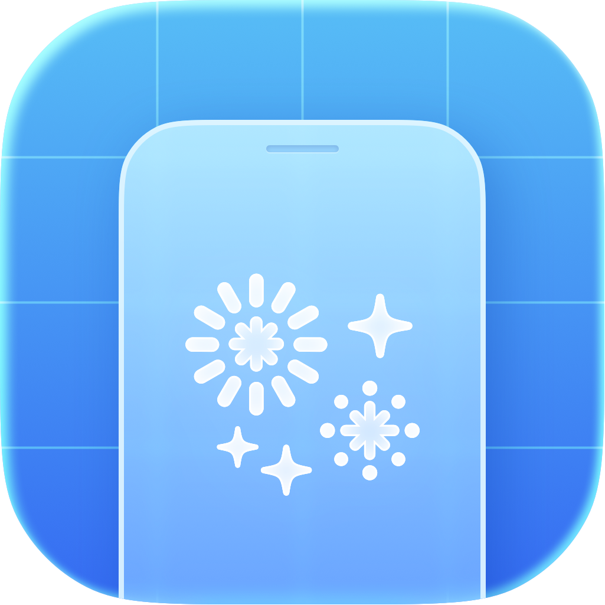

<p align="center">
  
</p>

<h3 align="center">Notelet</h3>

<p align="center">SwiftUI package for showing "What's New" notes in iOS apps</p>

<p align="center">
    
    
</p>

It supports:
- iOS 17+
- iPadOS 17+ (via iOS platform support)

You provide versioned notes, then control presentation with `NoteletPresentedVersion`.

---

## Installation

### Swift Package Manager (Xcode)

1. In Xcode, open your app project.
2. Go to **File → Add Package Dependencies...**.
3. Enter the repo URL https://github.com/mykolaharmash/notelet into the search.
4. Click on "Add package".
5. Add `Notelet` your app target.

---

## Usage

### 1) Import and define notes

```swift
import SwiftUI
import Notelet

private let releaseNotes: [NoteletVersionNotes] = [
    .init(
        version: "1.2.0",
        items: [
            .list(
                title: "Better everyday flow",
                rows: [
                    .init(
                        symbolSystemName: "bolt.fill",
                        title: "Faster startup",
                        description: "The app now opens quicker on cold launch."
                    ),
                    .init(
                        symbolSystemName: "text.bubble.fill",
                        title: "Smoother chat UI",
                        description: "Scrolling and message rendering feel more responsive."
                    )
                ]
            ),
            .media(
                kind: .image,
                url: URL(string: "https://example.com/feature-image.jpg")!,
                title: "Fresh home screen",
                description: "A cleaner layout with better content spacing."
            ),
            .media(
                kind: .video,
                url: URL(string: "https://example.com/feature-video.mp4")!,
                title: "New interaction",
                description: "A quick preview of the updated gesture flow."
            )
        ]
    )
]
```

### 2) Add presentation state

```swift
@State private var presentedVersion: NoteletPresentedVersion? = nil
```

### 3) Attach the sheet modifier

```swift
.noteletSheet(
    notes: releaseNotes,
    version: presentedVersion
)
```

### 4) Show automatically on `onAppear` (current app version)

```swift
.onAppear {
    presentedVersion = .current
}
```

### 5) Show manually on button tap (specific version)

```swift
Button("Show What's New 1.2.0") {
    presentedVersion = .v("1.2.0")
}
```

### Full example

```swift
import SwiftUI
import Notelet

struct ContentView: View {
    @State private var presentedVersion: NoteletPresentedVersion? = nil

    private let notes: [NoteletVersionNotes] = [
        .init(
            version: "1.2.0",
            items: [
                .list(
                    title: "What changed",
                    rows: [
                        .init(
                            symbolSystemName: "wand.and.stars",
                            title: "New editor tools",
                            description: "More formatting options with less taps."
                        ),
                        .init(
                            symbolSystemName: "lock.shield.fill",
                            title: "Privacy update",
                            description: "Sensitive data handling is now stricter."
                        )
                    ]
                ),
                .media(
                    kind: .image,
                    url: URL(string: "https://example.com/notes-image.jpg")!,
                    title: "Updated UI",
                    description: "Refreshed visuals across key screens."
                ),
                .media(
                    kind: .video,
                    url: URL(string: "https://example.com/notes-video.mp4")!,
                    title: "Quick walkthrough",
                    description: "A short clip showing the new flow."
                )
            ]
        )
    ]

    var body: some View {
        VStack(spacing: 16) {
            Button("Show What's New (1.2.0)") {
                presentedVersion = .v("1.2.0")
            }
        }
        .onAppear {
            presentedVersion = .current
        }
        .noteletSheet(
            notes: notes,
            version: presentedVersion,
            onDismiss: { presentedVersion = nil }
        )
    }
}
```

`version` behavior:
- `.current` -> tries to show notes for the current app version
- `.v("1.2.0")` -> tries to show notes for that specific version
- `nil` -> keeps the sheet hidden

---

## Note types

`NoteletVersionNoteItem` supports three note types:

### List

Use `.list(title:rows:)` for text-based highlights.

```swift
.list(
    title: "Highlights",
    rows: [
        .init(
            symbolSystemName: "sparkles",
            title: "Polished details",
            description: "Small UI upgrades throughout the app."
        )
    ]
)
```

### Video

Use `.media(kind: .video, ...)` with a video URL.

```swift
.media(
    kind: .video,
    url: URL(string: "https://example.com/demo.mp4")!,
    title: "Feature demo",
    description: "See the flow in action."
)
```

### Image

Use `.media(kind: .image, ...)` with an image URL.

```swift
.media(
    kind: .image,
    url: URL(string: "https://example.com/preview.jpg")!,
    title: "UI preview",
    description: "A quick look at the redesign."
)
```

Media layout behavior:
- Media is always shown in a **1:1 container**.
- Images and videos are **centered and cropped** to fill that square (aspect-fill behavior).

---

## Additional configuration

You can customize button labels and accent color with `NoteletConfiguration`:

```swift
.noteletSheet(
    notes: notes,
    version: .current,
    configuration: .init(
        nextButtonLabel: "Continue",
        doneButtonLabel: "Got it",
        accentColor: .orange
    )
)
```

Available configuration fields:
- `nextButtonLabel`
- `doneButtonLabel`
- `accentColor`

---

## Latest viewed version storage

Notelet stores the latest seen version in `UserDefaults` using:

`NOTELET_APP_STORAGE_LATEST_SEEN_APP_VERSION_KEY`

That value is used when presenting with `version: .current`.
When the sheet is dismissed in current-version mode, Notelet marks the current app version as seen automatically.

You can set it manually if needed, for example after onboarding, so the sheet does not appear immediately for new users:

```swift
import Notelet

noteletMarkCurrentVersionAsSeen()
```

A common pattern:
- After onboarding finishes, set the key to the current app version.
- Later, when a new app version ships, `version: .current` can show only fresh notes.
